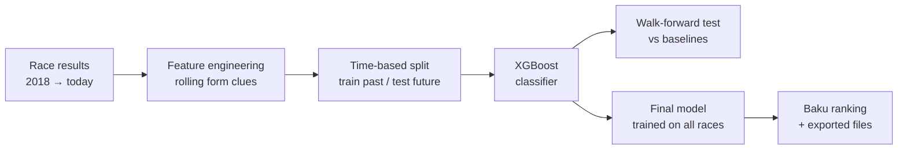

# 🏁 F1 Race Winner Predictor: Azerbaijan Grand Prix (Baku)

A beginner-friendly, end-to-end machine learning project that answers one question:

> **Who does the model rank highest for the Azerbaijan Grand Prix, using only what is known before qualifying?**

It downloads real Formula 1 results, turns recent form into features, trains an **XGBoost** classifier, tests it honestly on races it has never seen, and exports the trained model for use in a dashboard or API.

[](https://colab.research.google.com/github/YOUR-USERNAME/YOUR-REPO/blob/main/Baku_ML_Prediction_Model.ipynb)


---

## Why this project is different from a typical "F1 predictor"

- **No data leakage.** Features are computed *before* each race and only updated *after* it, so a race can never see its own result.
- **Time-based testing.** Train on the past, test on the future. Drivers from the same race never end up on both sides of the split.
- **Honest baselines.** The model is compared with simple rules of thumb ("pick the driver with the best recent finishes") and a random guess.
- **Uncertainty is shown, not hidden.** Results include 95% ranges, a calibration table, and a walk-forward test across four seasons, because ~24 races is a small sample.
- **Scores are not sold as probabilities.** The output is a normalized *ranking score*, and the notebook checks how well it matches reality.

## How it works



1. **Data**: race results for every season since 2018 via [FastF1](https://docs.fastf1.dev/)'s Ergast-compatible interface (served by the community-run Jolpica-F1 API).
2. **Checks**: no duplicates, exactly one winner per race, no half-empty grids.
3. **Features**: nine "clues" summarizing recent form (below).
4. **Training**: XGBoost learns "does this driver win?" from every historical driver-race.
5. **Testing**: held-out 2025 season, then walk-forward testing (2022-2025) against baselines.
6. **Prediction**: a final model trained on every completed race ranks the Baku field.
7. **Project Link**: The interface displaying the results in lovable  https://f1-dash-glory.lovable.app

## Features

| Group | Feature | Meaning |
|---|---|---|
| Driver form | `driver_finish_5` | Average finish over the last 5 starts |
| Driver form | `driver_points_5` | Average points over the last 5 starts |
| Driver form | `driver_win_rate_5` | Fraction of the last 5 starts won |
| Driver form | `driver_podium_rate_5` | Fraction of the last 5 starts on the podium |
| Team form | `team_points_5` | Average combined team points, last 5 races |
| Team form | `team_win_rate_5` | Fraction of the last 5 races won by either car |
| Circuit history | `circuit_finish_3` | Average finish over the last 3 starts at this circuit |
| Circuit history | `circuit_win_rate_3` | Fraction of those circuit starts won |
| Experience | `driver_history_count` | Number of prior starts available (capped at 5) |

Eight optional features are computed but **off by default**, and the notebook includes an **ablation test** that shows whether they actually help before you turn them on:

| Optional clues | Meaning |
|---|---|
| `driver_season_share`, `team_season_share` | Share of all championship points scored so far this season |
| `driver_same_{street,corners,power}_finish_5` | The driver's average finish over the last 5 starts on circuits **like the target one** |
| `team_same_{street,corners,power}_points_5` | The team's average points over the last 5 races on circuits like the target one |

"Like the target one" uses three circuit tags:

| Tag | Values | Source |
|---|---|---|
| `street` | street / permanent | hand-labelled in the notebook (editable) |
| `corners` | fast corners / slow technical / mixed | hand-labelled in the notebook (editable) |
| `power` | high / medium / low | **measured** from lap telemetry (see below) |

There is also a **"who excels where?"** table that compares each driver with their teammate on each type of circuit, which separates driver skill from car performance.

## Results snapshot

Run with data through **13 Sep 2026**, ahead of the Azerbaijan GP on **26 Sep 2026**. Numbers change as new races are added and whenever you re-run the notebook.

**Held-out test on the 2025 season (24 races)**

| Method | Winners picked | Accuracy |
|---|---|---|
| XGBoost | 8 / 24 | 33.3% |
| Best recent finish (rule of thumb) | 7 / 24 | 29.2% |

The model is ahead, but by one race. With only 24 races the 95% ranges overlap almost completely (roughly 18-53% vs 15-49%), so this is **not** evidence that the model is meaningfully better than a simple rule. That is exactly why the notebook also runs walk-forward testing over four seasons; re-run it and paste your own table here.

**Model ranking for Baku (pre-qualifying)**

| Rank | Driver | Team | Model score |
|---|---|---|---|
| 1 | Andrea Kimi Antonelli | Mercedes | 53.6% |
| 2 | Max Verstappen | Red Bull | 13.2% |
| 3 | Lando Norris | McLaren | 10.9% |
| 4 | George Russell | Mercedes | 7.8% |
| 5 | Charles Leclerc | Ferrari | 5.5% |

> ⚠️ The score is a **normalized ranking score, not a calibrated win probability**. A 53.6% score does not mean a 53.6% chance of winning. See the calibration table in Section 5 of the notebook.

## Quick start

### Option 1: Google Colab (easiest)
Click the **Open in Colab** badge above and run all cells. No installation needed.

### Option 2: Run locally

```bash
git clone https://github.com/YOUR-USERNAME/YOUR-REPO.git
cd YOUR-REPO
python -m venv .venv && source .venv/bin/activate   # Windows: .venv\Scripts\activate
pip install -r requirements.txt
jupyter notebook Baku_ML_Prediction_Model.ipynb
```

The first run downloads results season by season and caches them in `baku_cache/`, so later runs are fast.

> **macOS note:** if `import xgboost` fails with *"libxgboost.dylib could not be loaded"*, install the OpenMP runtime with `brew install libomp`, then restart the Jupyter kernel.

## Predicted points finishers (top 10)

The notebook trains a **second, separate model** for "who finishes in the points" — this is a different question from "who wins," so it gets its own target, its own walk-forward test, and its own baselines. A driver's win score and their points-finish score are two different numbers in the output; a strong win chance implies a strong points chance, but not the reverse.

**Read the baseline before trusting the headline number.** F1 fields are usually 18-24 cars, so the top 10 is close to *half* the field. Even a coin flip picks about half of them right, so the notebook always shows a "Random 10 drivers" reference line next to the model's precision@10 — the model's real skill is whatever it adds over that, not the raw percentage.

## Measure how power-hungry each circuit is (optional)

`get_power_index.py` uses FastF1 lap telemetry to measure the share of a fast qualifying lap spent flat out at each circuit. Circuits are then split into low / medium / high power thirds. Without it, the notebook falls back to rough hand-made ratings and says so.

```bash
python get_power_index.py --before 2026-09-26   # date of the race you are predicting
```

- Only races **before** that date are measured, so the target race never feeds its own features.
- It measures the newest 2 races per circuit (about 50 sessions), saves after every session, and can be re-run to resume.
- It downloads telemetry, so the first run is slow and the cache (`f1_telemetry_cache/`) can reach a few GB.
- It writes `circuit_power_index.csv` next to the notebook. Commit that small file if you want others to reproduce your results without downloading telemetry.

## Predict a different race

Edit the **Settings** cell at the top of the notebook:

```python
TARGET_YEAR = 2026
CIRCUIT_ID = 'baku'   # e.g. 'monza', 'silverstone', 'spa'
```

If the circuit is not in the `CIRCUIT_TRAITS` table, add a line for it (street? corners?) so its circuit-type clues are not blank. By default the field is taken from the most recent completed race. If there are driver changes, drop a `baku_entries.csv` next to the notebook (named `<CIRCUIT_ID>_entries.csv`) with these columns:

```csv
driverId,constructorId,driver,team
```

## Outputs

Everything is written to `baku_outputs/`:

| File | Contents |
|---|---|
| `baku_predictions.json` / `.csv` | Full field ranked by win score, plus run metadata and evaluation metrics |
| `baku_points_predictions.csv` | Predicted top-10 (points-scoring) finishers, with predicted position and points |
| `baku_inputs.json` | The exact feature values used for each driver |
| `baku_model.json` | Trained win-prediction model (portable format) |
| `baku_points_model.json` | Trained points-finisher model (portable format) |
| `baku_model.joblib` | Both trained models, with feature list and metadata (Python) |
| `baku_model_metadata.json` | Feature list and run metadata |
| `Baku_XGBoost_Dashboard_Data.json` | Both models + inputs + predictions + reference test cases, for a dashboard or API to consume (see below) |
| `requirements.txt` | Exact library versions used for the run |

### `Baku_XGBoost_Dashboard_Data.json` structure

This is the file to hand to a dashboard (e.g. Lovable). Its top-level keys:

| Key | Contents |
|---|---|
| `win_model` | The win-prediction model, portable XGBoost JSON format |
| `points_model` | The points-finisher model, same format |
| `predictions` (inside `metadata`) | Full field ranked by win score |
| `points_predictions` | Predicted top-10 finishers, with predicted position and points |
| `inputs` | The exact feature values used for each driver in this run |
| `metadata.evaluation` | Accuracy metrics for both models — winner accuracy, walk-forward results, and `points_model` (precision@10, log loss, Brier score, plus the random-guess reference) |
| `verification` | Reference cases (inputs + expected scores) so you can check a JS reimplementation reproduces the **win model's** exact numbers. Points-model reference cases aren't included yet |
| `model` | Same as `win_model`, kept only so older code that expects a `model` key still works |


## Limitations

- **Pre-qualifying only.** No grid position, qualifying, weather, tyre strategy, safety cars, or race pace, which are among the strongest predictors on race weekend.
- **Small sample.** F1 has ~24 races a year and one winner each, so accuracy figures are noisy. Always read them alongside the 95% range.
- **Regulation changes.** The model learns from past eras; a season with new rules is harder to predict than a stable one.
- **Circuit history is thin.** A driver may have only a handful of starts at a given circuit. The similar-circuit clues pool related tracks to help, but they may still be too noisy to improve the model.
- **Circuit tags are partly subjective.** `street` and `corners` are hand-labelled, and `power` is measured from a single fast lap per session, so treat them as approximations.
- **Driver vs car is hard to separate.** Team-level and teammate-relative views help, but results data has no engine-supplier information.
- **Field is provisional.** Unless you supply an entry list, the field is assumed to match the last race.
- **Educational project.** Not for betting or any financial decision.

## Roadmap

- [ ] Add qualifying and grid position for a post-qualifying model
- [ ] Try a ranking objective (`XGBRanker`) instead of "binary classifier + normalize"
- [ ] Add reliability/DNF features
- [ ] Calibrate scores (isotonic regression or temperature scaling)
- [ ] Tune hyperparameters with walk-forward cross-validation
- [ ] Serve the model behind a small FastAPI endpoint

## Project structure

```
.
├── Baku_ML_Prediction_Model.ipynb   # the full walkthrough (data → features → model → test → predict)
├── get_power_index.py               # optional: measures circuit power from FastF1 telemetry
├── circuit_power_index.csv          # created by the script above
├── requirements.txt
├── README.md
├── baku_cache/                      # created on first run (downloaded results)
└── baku_outputs/                    # created on first run (model + predictions)
```

## Credits

- Race data: [FastF1](https://github.com/theOehrly/Fast-F1) and the [Jolpica-F1](https://github.com/jolpica/jolpica-f1) API (successor to Ergast).
- Model: [XGBoost](https://xgboost.readthedocs.io/).
- Based on / inspired by: **[@Mar_antaya and the build club where i got the base model and insights from]**.
